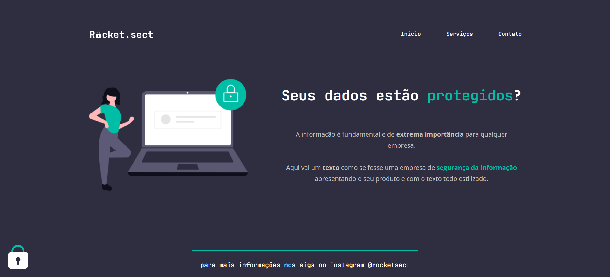

<p align="center"></p>

<div align="center">
	<h1 align="center">Rocket.sect</h1>
	<p align="center">Aplicação desenvolvida em um desafio de recriação de layout, lançado no curso Explorer 3.0 da Rocketseat no nível 2, na qual foi disponibilizado um design no figma.</p>
</div>
<h3  align="center">
		✅ Status: concluído ✅
</h3>
<div align="center">
<a href="https://rocketsect-joaogabriel.vercel.app" target="_blank" >Acesse a aplicação clicando aqui !</a>
</div>


## :page_facing_up: Conteúdo
- [Demonstração](#tv-demonstração)
- [Tecnologias](#hammer_and_wrench-tecnologias)
- [Pré-requisitos](#warning-pré-requisitos)
- [Como rodar?](#fire-rodando-a-aplicação)
- [Autor](#nerd_face-autor)


## :tv: Demonstração

<p align="center">
  
</p>


## :hammer_and_wrench: Tecnologias
- [HTML](https://developer.mozilla.org/pt-BR/docs/Web/HTML)
- [CSS](https://developer.mozilla.org/pt-BR/docs/Web/CSS)
  - [Flexbox](https://developer.mozilla.org/pt-BR/docs/Web/CSS/CSS_Flexible_Box_Layout/Basic_Concepts_of_Flexbox)


## :warning: Pré-requisitos
Antes de começar, você vai precisar ter instalado em sua máquina as seguintes ferramentas:

- [Git](https://git-scm.com){:target="_blank"}
- [VSCode](https://code.visualstudio.com/)
- [LiveServer](https://marketplace.visualstudio.com/items?itemName=ritwickdey.LiveServer).


## :fire: Rodando a aplicação
```bash
# Clone este repositório
$ git clone git@github.com:joaogabrieldev/rocket.sect.git

# Acesse a pasta do projeto no vscode ou no seu gerenciador de arquivos

# Execute o arquivo index.html com o LiveServer pelo vscode
# ou abra o arquivo index.html no seu navegador

# A aplicação iniciará localmente na sua maquina!
```


## :nerd_face: Autor
<div align="center" >
<a href="https://www.linkedin.com/in/joaogabrieldev/" target="_blank" >
 
 <br />
 <b>João Gabriel</b></a> <a href="https://www.linkedin.com/in/joaogabrieldev/" title="Linkedin">🚀
</a>

Feito com ❤️ por João Gabriel 👋🏽 Entre em contato!

[](https://www.instagram.com/joaogabriel.fn/) [](https://www.linkedin.com/in/joaogabrieldev/) [](mailto:dev.joaogabriel@gmail.com) [](https://t.me/joaogabrielfn)

</div>

## 📕License

This project is under the [MIT](./LICENSE).
